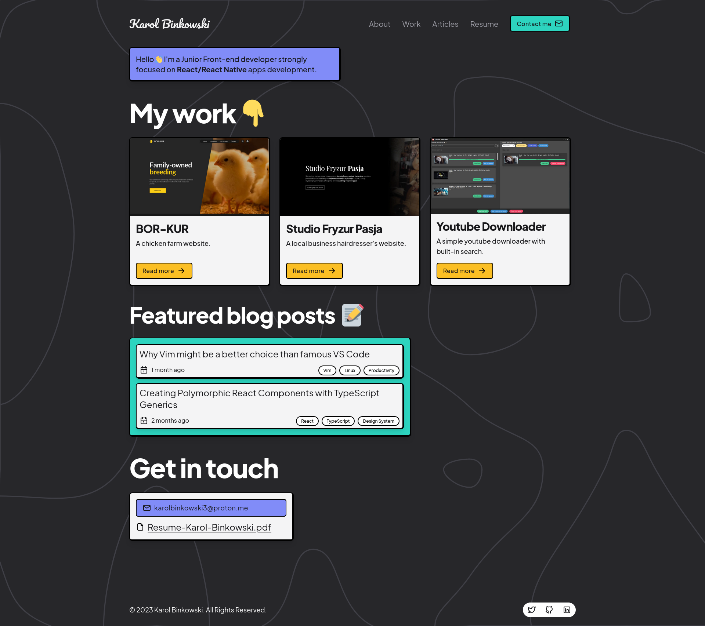
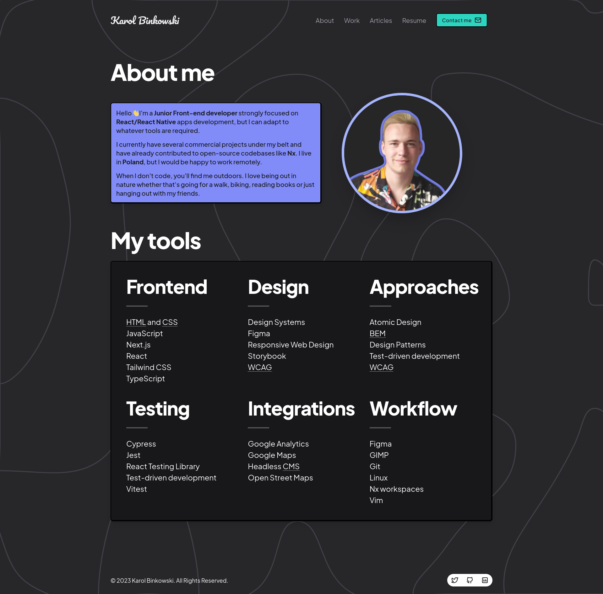
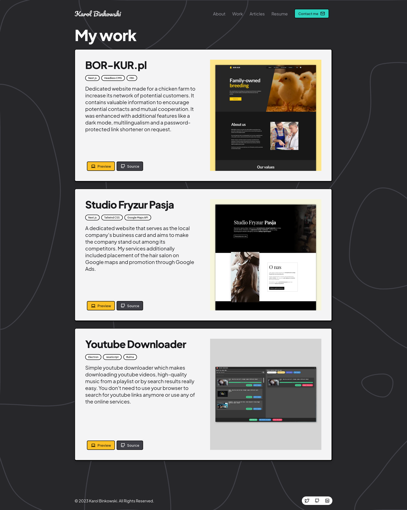
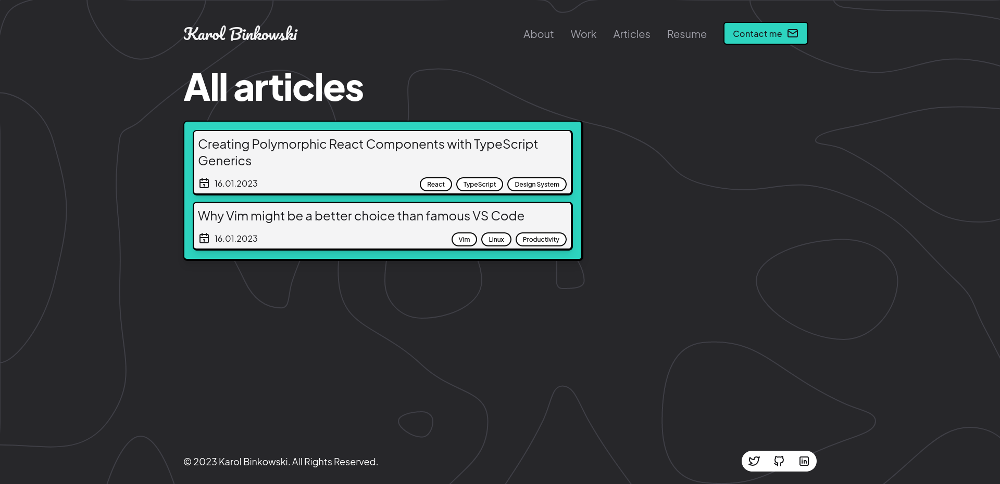

# Karbin - A digital garden to put my articles and projects.

My personal website with expansion possibilities based on the design system of my personal brand.

## Demo

[karolbinkowski.me](https://karolbinkowski.me/)

## Screenshots







## Tech Stack

**Framework:** `Next.js`, `React`

**Design:** `CVA`, `Storybook`, `Tailwind CSS`, `@tabler/icons`

**Blog:** `gray-matter`, `highlight.js`, `next-mdx-remote`

**Workflow:** `ESLint`,`Nx`, `TypeScript`, `Prettier`


## Features

- Blog with MDX and code snippet support
- Extensible Design System based on React, Storybook and Tailwind CSS

## Roadmap

- Improve UX
- Extract site components to the design system

**You can check out all the planned changes, fixes and refactorings [here](https://github.com/users/GrzywN/projects/3/).**
## Run Locally

Clone the project

```bash
  git clone https://github.com/GrzywN/karbin.git
```

Go to the project directory

```bash
  cd karbin
```

Install dependencies

```bash
  yarn install
```

Start the server

```bash
  yarn start
```
## Run Locally

Clone the project

```bash
  git clone https://github.com/GrzywN/karbin.git
```

Go to the project directory

```bash
  cd karbin
```

Install dependencies

```bash
  yarn install
```

Start the server

```bash
  yarn start
```
## Running Tests

To run tests, run the following command

```bash
  yarn test site
  yarn test shared-ui
```
To run e2e tests, run the following command

```bash
  yarn nx e2e shared-ui-e2e
```


## Deployment

To deploy this project on Vercel:

- Set `Output Directory` to `dist/apps/site/.next`.
- Install dependencies using yarn `yarn install`
- Run `yarn nx build site --prod`
